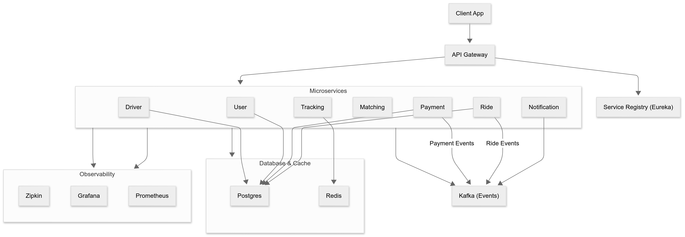
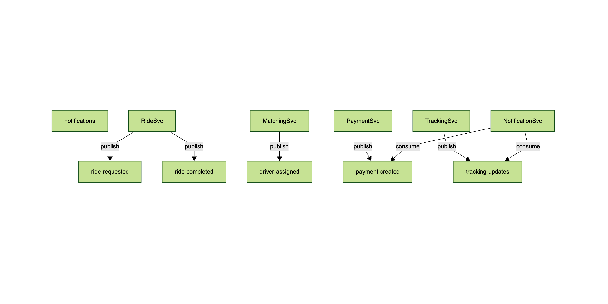
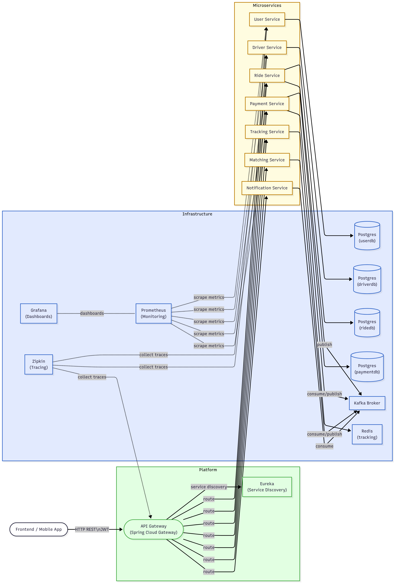
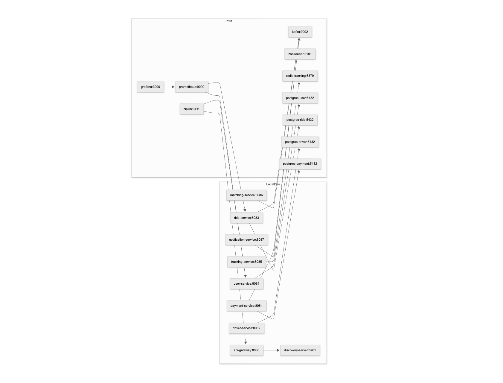
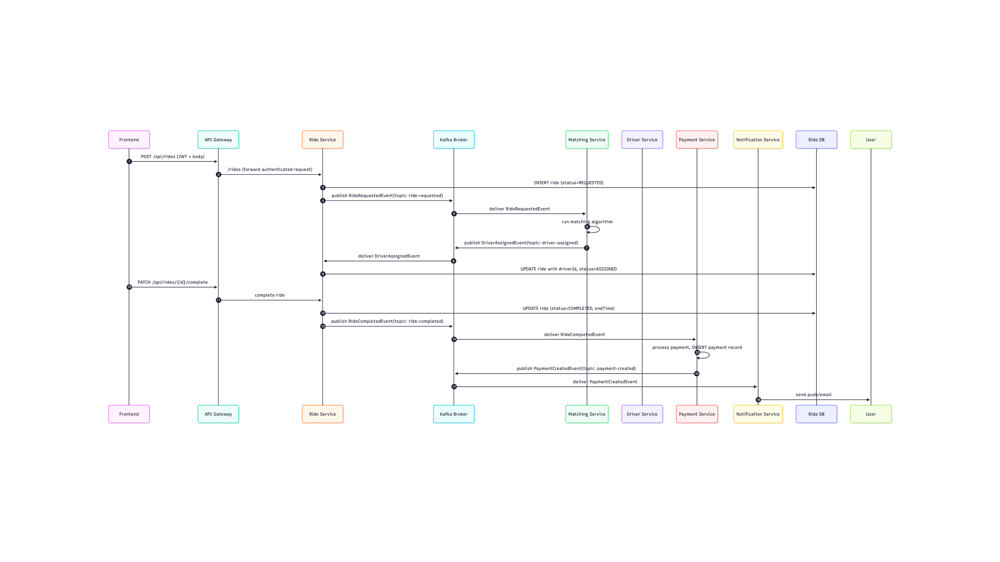

# 🚖 Mini-Uber Backend (Microservices Architecture)

A production-grade **event-driven microservices project** inspired by Uber, built with **Spring Boot, Kafka, Eureka, Gateway, Zipkin, Prometheus/Grafana, Redis, and Postgres**.

---

## 🏗️ Architecture

 <!-- you can export from draw.io -->

## 🏗️ Kafka topics map

 <!-- you can export from draw.io -->


### Services
- **API Gateway** (Spring Cloud Gateway + JWT Security + Resilience4j)
- **Discovery Server** (Eureka Service Registry)
- **User Service** (Postgres + JPA)
- **Driver Service** (Postgres + JPA)
- **Ride Service** (Postgres + Kafka producer/consumer)
- **Matching Service** (Kafka consumer/producer for driver assignment)
- **Payment Service** (Postgres + Kafka consumer/producer)
- **Tracking Service** (Redis for live driver tracking)
- **Notification Service** (Kafka consumer, logs notifications)

### Event Pipeline (Kafka)
1. Ride requested → published by **ride-service**
2. Consumed by **matching-service** → driver assigned
3. Driver assignment consumed by **ride-service** → ride started
4. Ride completed → published by **ride-service**
5. Consumed by **payment-service** → payment created
6. Consumed by **notification-service** → notification sent

---

## 🏗️ Component Diagram

 <!-- you can export from draw.io -->

---

## 🚀 Features

✅ Microservices with service discovery & load balancing  
✅ Secure Gateway with **JWT Authentication**  
✅ **Kafka event-driven** communication between services  
✅ **Distributed tracing** with Zipkin (traceId across HTTP + Kafka)  
✅ **Metrics & monitoring** with Prometheus + Grafana  
✅ **Resilience4j** Circuit Breakers & fallback in API Gateway  
✅ **Redis caching** for driver tracking  
✅ PostgreSQL persistence with JPA + Flyway migrations  
✅ Centralized logging & observability

---

## 🛠️ Tech Stack

- **Spring Boot 3**, **Spring Cloud**
- **Postgres**, **Redis**
- **Apache Kafka**
- **Zipkin**, **Micrometer**, **Prometheus**, **Grafana**
- **Resilience4j**
- **Docker** (optional, can run locally)
- **JUnit/Testcontainers** for integration tests

---

## 🏗️ Deployment and ports

 <!-- you can export from draw.io -->

---


## 🏗️ Sequence Diagram — Ride lifecycle

 <!-- you can export from draw.io -->

---
## ⚡ Run Locally

### 1. Start Infrastructure

Make sure you have:
- Postgres running on:
    - user-service → `5432`
    - driver-service → `5433`
    - ride-service → `5434`
    - payment-service → `5435`
- Redis on `localhost:6379`
- Kafka broker on `localhost:29092`
- Zipkin on `http://localhost:9411`
- Prometheus on `http://localhost:9090`
- Grafana on `http://localhost:3000`

> These can be started with `docker-compose -f infra/docker-compose.yml up`.

---

### 2. Run All Services

One command 🚀:

```bash
./run-all.sh
